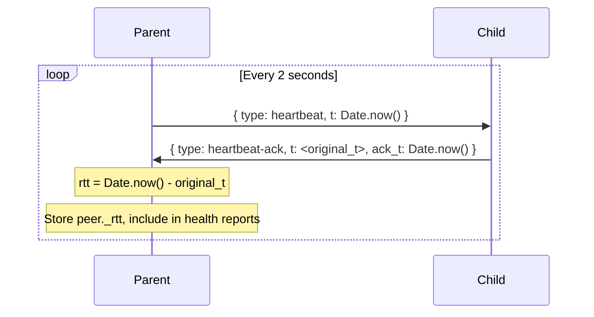
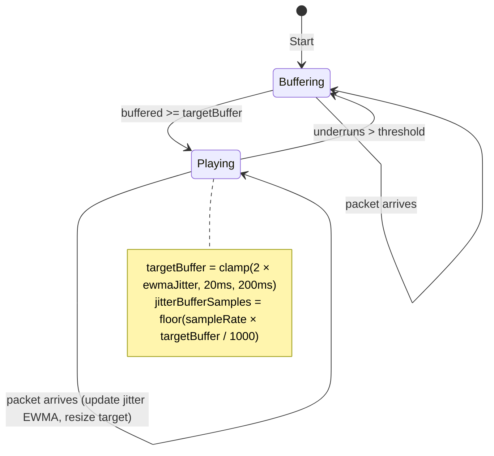
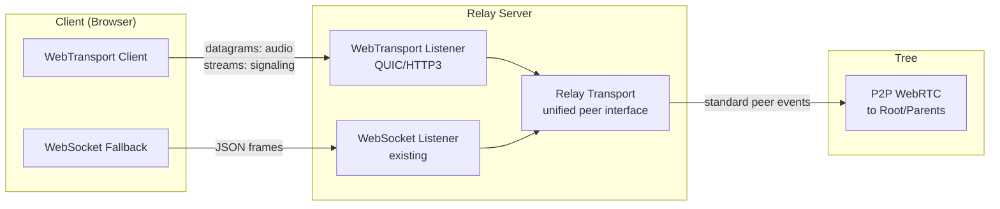

# feat: Low-latency voice adaptations inspired by OpenAI's WebRTC architecture

## Summary

Adapt techniques from OpenAI's low-latency voice AI infrastructure and the MoQ/WebTransport critique of WebRTC into the fireflower ecosystem. The work spans three repos — fireflower (core networking), fireflower-audio (audio broadcasting), and fireflower-visualizer (topology display) — organized into three phases: measurement and peer selection intelligence, audio pipeline optimization, and a WebTransport-based relay transport as an alternative to the WebSocket/ChannelShim stack.

**Target repos:** `fireflower-1` (the complete version with heartbeat, health scoring, and relay server), `fireflower-audio`, `fireflower-visualizer` (all at `~/Source/`)

---

## Problem Frame

Fireflower's P2P tree broadcasting works but leaves latency on the table in several areas that OpenAI's architecture and the MoQ critique illuminate:

- **Peer selection is latency-blind** — `_reviewResponses` sorts by health score and level but has no RTT signal, so a child may connect to a high-health parent 200ms away instead of a slightly-lower-health parent 30ms away.
- **The jitter buffer is fixed at 40ms** — good for stable networks, too small for jittery ones, too large for excellent ones. OpenAI uses a dynamic jitter buffer that resizes based on real-time network telemetry.
- **Audio relay allocates on every frame** — the capture worklet creates a new `Float32Array` per 20ms frame and the channel manager allocates on every relay, creating GC pressure in the hot audio path.
- **Backpressure is binary** — frames are either sent or dropped with no priority awareness; speech-onset frames are dropped as readily as mid-stream frames.
- **The WebSocket relay stack is complex** — `ServerTransport` → `ChannelShim` → `ServerPeerAdapter` emulates WebRTC data channels over WebSocket, requiring 8+ RTTs for full WebRTC handshake setup. WebTransport over QUIC achieves 1 RTT handshake with native ordered/unordered streams, eliminating the channel shim entirely.

---

## Requirements

- R1. Nodes measure RTT to upstream peer via heartbeat round-trip and include it in health reports
- R2. Peer selection weights RTT alongside health score and level when choosing upstream
- R3. Audio frame drop rate is tracked per-node and published in health reports
- R4. Capture worklet reuses pre-allocated buffers instead of allocating per frame
- R5. Playback jitter buffer dynamically resizes based on observed inter-packet jitter
- R6. Backpressure distinguishes speech-onset frames (never drop) from mid-stream frames
- R7. Audio relay logic runs in a dedicated Worker on relay nodes, off the main thread
- R8. A WebTransport-based relay transport exists as an alternative to the WebSocket relay, with 1-RTT handshake and native unordered streams for audio
- R9. The visualizer displays RTT and drop rate metrics in the overlay and node info panel
- R10. All changes are backward-compatible — nodes with/without these features can coexist in the same tree

---

## Scope Boundaries

- No changes to the WebRTC P2P path — it remains the primary transport for direct peer connections
- No QUIC-LB or anycast routing — that's infrastructure-level work beyond the application layer
- No changes to Firebase signaling paths or the request/response protocol structure (RTT and drop rate ride as additional fields on existing structures)
- No migration of existing connections — these features apply to new connections only

### Deferred to Follow-Up Work

- **Connection-ID-based routing (QUIC-LB style)**: Encoding routing metadata in QUIC connection IDs — requires infrastructure coordination beyond app-level changes
- **WebTransport P2P via WebRTC-compatible ICE**: Using WebTransport for P2P connections (not just relay) — blocked on browser/spec maturity
- **Clustered relay server**: Running multiple relay workers behind a shared endpoint — natural follow-up once WebTransport relay is proven
- **Opus bitrate adaptation**: Dynamically adjusting Opus bitrate based on network conditions — complements the jitter buffer work but is a separate concern

---

## Context & Research

### Relevant Code and Patterns

**fireflower-1 (core):**
- `index.js:_reviewResponses` (lines 580-720) — peer selection with `healthSort` comparator
- `index.js:_getHealthScore` / `_getHealthData` (lines 1700-1760) — health computation and reporting
- `index.js:_onheartbeat` (lines 1625-1670) — heartbeat handler with timeout tiers
- `index.js` heartbeat send (lines 1490-1510) — parent sends `{ type: 'heartbeat', t: Date.now() }` every 2s
- `relay-server.js` — WebSocket server with `ServerPeerAdapter` wiring
- `server-transport.js` — WebSocket client transport with `ChannelShim` emulation
- `channel-shim.js` — data channel emulation over WebSocket

**fireflower-audio:**
- `src/channel.js:AudioChannelManager` — relay logic with `AUDIO_BACKPRESSURE_THRESHOLD = 200` bytes
- `src/worklets/capture-processor.js` — frame accumulation, allocates `new Float32Array(this.buffer)` per frame (line 90)
- `src/worklets/playback-processor.js` — ring buffer jitter buffer, fixed at `jitterBufferMs = 40`
- `index.js:_broadcastFrame` (lines 406-414) — 1-byte header + payload framing

**fireflower-visualizer:**
- `index.js` (lines 88-159) — report aggregation and stats display
- `src/nodes/single.js` — GC-optimized node rendering with pre-allocated `CANNON.Vec3` temporaries
- `share/index.html` (lines 135-167) — overlay HTML structure

### External References

- [OpenAI: Delivering Low-Latency Voice AI at Scale](https://openai.com/index/delivering-low-latency-voice-ai-at-scale/) — relay/transceiver split, SO_REUSEPORT, pre-allocated buffers, dynamic jitter buffer, ufrag routing
- [MoQ: WebRTC Is the Problem](https://moq.dev/blog/webrtc-is-the-problem) — QUIC/WebTransport as relay transport, 1-RTT handshake, connection-ID routing, critique of WebRTC for server-mediated scenarios
- [InfoQ: OpenAI WebRTC Architecture](https://www.infoq.com/news/2026/05/openai-voice-ai-scale/) — Go implementation details, GC pressure reduction

---

## Key Technical Decisions

- **RTT measured via heartbeat echo, not separate probe**: The heartbeat already fires every 2s with a timestamp. Adding an ack response gives RTT measurement with zero additional traffic. The 2s granularity is sufficient for peer selection (we don't need sub-second RTT updates).

- **RTT incorporated into peer selection as a tiebreaker, not primary sort**: Health score remains the primary ranking signal. RTT breaks ties when health scores are within 20 points — this preserves the existing "pick healthy parents" behavior while avoiding high-latency parents among equally-healthy candidates.

- **Dynamic jitter buffer uses exponentially-weighted moving average (EWMA) of inter-packet jitter**: Simpler than OpenAI's full network telemetry approach but effective. The buffer targets `2× current_jitter` clamped to `[20ms, 200ms]`. The EWMA smoothing constant prevents oscillation on transient spikes.

- **WebTransport relay as a new transport option alongside WebSocket, not a replacement**: WebTransport browser support is broad (Chrome 97+, Edge 97+, Firefox 114+, Safari 17.4+) but the WebSocket path remains as fallback. The relay server advertises both endpoints; clients prefer WebTransport when available.

- **Speech-onset priority via a 1-bit flag in the audio frame header**: The existing header byte has 7 unused bits (only bit 0 distinguishes Opus/PCM). Bit 1 marks speech-onset frames. The relay layer checks this bit before applying backpressure — onset frames are never dropped.

- **Audio relay in a Worker, not SharedArrayBuffer**: SharedArrayBuffer requires cross-origin isolation headers. A dedicated Worker with `postMessage` transferables (zero-copy for typed arrays) avoids this constraint while still moving relay off the main thread.

---

## Open Questions

### Resolved During Planning

- **Where to measure RTT — client or parent?**: Parent-side. Parent sends heartbeat with `t`, child echoes with `{ type: 'heartbeat-ack', t, ack_t }`, parent computes `(now - t)` as RTT. This avoids clock skew since the same clock is used for both measurements.
- **Should the jitter buffer resize on every packet or periodically?**: On every packet but with EWMA smoothing. This gives fast adaptation without oscillation.
- **WebTransport datagrams vs unreliable streams for audio?**: Datagrams — they map directly to the current `ordered: false, maxRetransmits: 0` semantics and have the lowest overhead.

### Deferred to Implementation

- **Exact EWMA smoothing constant for jitter buffer**: Start with `alpha = 0.125` (matching TCP's SRTT calculation), tune based on real-world testing
- **WebTransport server library choice**: Likely `@aspect-build/webtransport` or Go's `quic-go/webtransport-go` — depends on whether the relay server stays in Node.js or moves to Go
- **Worker message passing overhead for audio relay**: Needs benchmarking — if `postMessage` adds >2ms per frame, consider SharedArrayBuffer with appropriate headers

---

## High-Level Technical Design

> *This illustrates the intended approach and is directional guidance for review, not implementation specification. The implementing agent should treat it as context, not code to reproduce.*

### RTT Measurement Flow

### Dynamic Jitter Buffer

### WebTransport Relay Architecture

---

## Phased Delivery

### Phase 1: Measurement & Peer Selection Intelligence

Core networking improvements that give the tree RTT awareness and richer health data. Must land first because audio and visualizer changes consume these new fields.

### Phase 2: Audio Pipeline Optimization

Buffer pooling, dynamic jitter buffer, enhanced backpressure, and worker-based relay. These are fully independent of Phase 1 at both the code and data level — the jitter buffer uses inter-packet arrival timing, not RTT.

### Phase 3: Transport Evolution

WebTransport-based relay transport. The largest architectural change — depends on Phase 1 (health reporting) and benefits from Phase 2 (audio pipeline is already optimized when the new transport lands).

---

## Implementation Units

### U1. Heartbeat RTT Measurement

**Goal:** Add round-trip time measurement to the existing heartbeat mechanism so every parent knows the RTT to each downstream child.

**Requirements:** R1

**Dependencies:** None

**Files:**
- Modify: `index.js` (fireflower-1) — heartbeat send logic, heartbeat handler, peer state
- Test: `test/run.js` (fireflower-1) — new RTT scenarios

**Approach:**
- Parent heartbeat already sends `{ type: 'heartbeat', t: Date.now() }` on the notifications channel every 2s
- Child adds a new message type handler: on receiving heartbeat, immediately respond with `{ type: 'heartbeat-ack', t: <received_t>, ack_t: Date.now() }`
- Parent's notifications `onmessage` handler parses `heartbeat-ack`, computes `rtt = Date.now() - msg.t`, stores on `peer._rtt`
- Use EWMA smoothing: `peer._rtt = peer._rtt ? 0.8 * peer._rtt + 0.2 * measured : measured`
- Server transport path: ChannelShim already carries notifications — heartbeat-ack flows the same way

**Patterns to follow:**
- Existing heartbeat handler in `_onheartbeat` (lines 1625-1670)
- Mask update message handling on notifications channel

**Test scenarios:**
- Happy path: Parent sends heartbeat, child acks, parent's `peer._rtt` is set to a positive number
- Happy path: After 5 heartbeat cycles, `peer._rtt` converges via EWMA smoothing
- Edge case: Child receives heartbeat before notifications channel is fully open — ack is silently dropped, no crash
- Edge case: Parent receives ack for a heartbeat it didn't send (stale/reordered) — ignored gracefully
- Integration: RTT measurement works over both P2P (WebRTC) and server (WebSocket) transport paths

**Verification:**
- Two connected nodes show non-zero `peer._rtt` values after one heartbeat cycle
- RTT values are stable (EWMA smoothed) across consecutive measurements

---

### U2. RTT and Drop Rate in Health Reports

**Goal:** Extend health data to include RTT to upstream and audio frame drop rate, and publish both in Firebase health reports.

**Requirements:** R1, R3

**Dependencies:** U1, U6

**Files:**
- Modify: `index.js` (fireflower-1) — `_getHealthData`, `_onreportNeeded`, response publishing in `_onrequest`
- Test: `test/run.js` (fireflower-1) — health report field scenarios

**Approach:**
- `_getHealthData()` gains two new fields: `rtt` (from `this.upstream._rtt` if connected) and `dropRate` (from a new `this._dropRate` counter, provided by U6)
- The `dropRate` field is optional — only set when fireflower-audio's channel manager reports it via a new `node.emit('dropRate', rate)` event
- Response publishing in `_onrequest` already includes `health: this._getHealthScore()` — add `rtt` to the response object so candidates advertise their RTT to their own upstream
- Firebase report at `reports/{nodeId}` gains `health.rtt` and `health.dropRate`

**Patterns to follow:**
- Existing health data shape: `{ score, uptime, reconnects, load, level, downstreamCount }`
- Report publishing in `_onreportNeeded` (lines 1756-1788)

**Test scenarios:**
- Happy path: Node with upstream connection publishes health report containing `rtt` field
- Happy path: Node receiving drop events publishes health report containing `dropRate` field
- Edge case: Root node has no upstream — `rtt` field is absent or null in report
- Edge case: Node without fireflower-audio loaded — `dropRate` field is absent (no crash, no undefined)
- Integration: Firebase report at `reports/{nodeId}/health` contains rtt and dropRate when available

**Verification:**
- Firebase health reports contain `rtt` and `dropRate` fields for nodes that have the data
- Nodes without RTT or drop data omit those fields cleanly (no `undefined` or `NaN`)

---

### U3. RTT-Aware Peer Selection

**Goal:** Incorporate RTT into the `_reviewResponses` ranking so children prefer lower-latency parents among equally-healthy candidates.

**Requirements:** R2

**Dependencies:** U2

**Files:**
- Modify: `index.js` (fireflower-1) — `_reviewResponses`, `healthSort` comparator
- Test: `test/run.js` (fireflower-1) — peer selection ranking scenarios

**Approach:**
- `healthSort` currently: if both have health and diff > 20, sort by health; else sort by level
- New logic: if health diff ≤ 20 (tiebreaker zone), and both have `rtt` values, prefer lower RTT; else fall back to level
- Response data already carries `health` — U2 adds `rtt` to the response object
- This preserves existing behavior for nodes without RTT data (backward compatible — R10)

**Patterns to follow:**
- Existing `healthSort` comparator (lines 627-637)
- The 20-point threshold convention for health-based decisions

**Test scenarios:**
- Happy path: Two candidates with health 80 and 75 (within 20) — candidate with lower RTT is selected
- Happy path: Two candidates with health 90 and 60 (diff > 20) — higher health wins regardless of RTT
- Edge case: One candidate has RTT, other doesn't — fall back to level comparison (no crash)
- Edge case: Both candidates have identical health and RTT — fall back to level
- Edge case: Candidate with higher RTT but much higher health (diff > 20) still wins — health remains primary

**Verification:**
- Peer selection demonstrably prefers lower-RTT parents when health scores are similar
- Existing health-first selection behavior is unchanged when health diff exceeds threshold

---

### U4. Pre-Allocated Buffer Pool for Audio Capture

**Goal:** Eliminate per-frame `Float32Array` allocation in the capture worklet by reusing buffers from a fixed pool.

**Requirements:** R4

**Dependencies:** None

**Files:**
- Modify: `src/worklets/capture-processor.js` (fireflower-audio) — frame posting logic
- Test: Manual — worklet code can't be unit tested in Node.js; verify via broadcaster smoke test

**Approach:**
- Currently line 90 allocates `new Float32Array(this.buffer)` every 20ms (50 allocations/second)
- Create a pool of N pre-allocated `Float32Array(samplesPerFrame)` buffers (N=8 gives 160ms of runway)
- On frame ready: grab next buffer from pool, copy samples, post with transferable
- The receiving main thread returns the buffer to the pool via `postMessage` after encoding
- Pool exhaustion fallback: allocate a new buffer (degrade gracefully, don't drop audio)

**Patterns to follow:**
- GC reduction pattern in fireflower-visualizer's `single.js` — pre-allocated `CANNON.Vec3` temporaries (`ZERO_VEC`, `_tmpVec`, `_pullVec`)
- Existing transferable usage in `_sendToWorklet` (fireflower-audio `index.js` lines 752-755)

**Test scenarios:**
- Happy path: 10 seconds of audio capture produces zero new Float32Array allocations beyond the initial pool
- Edge case: Pool exhaustion under sustained speech — fallback allocation works, no audio dropout
- Edge case: Buffer return from main thread is delayed — pool temporarily shrinks, recovers when buffers return

**Verification:**
- Audio capture works identically to before (same frame content, same timing)
- Chrome DevTools memory timeline shows flat allocation pattern during sustained capture (no sawtooth GC)

---

### U5. Dynamic Jitter Buffer

**Goal:** Replace the fixed 40ms jitter buffer with one that resizes based on observed inter-packet arrival jitter, improving playback quality on both stable and unstable networks.

**Requirements:** R5

**Dependencies:** None

**Files:**
- Modify: `src/worklets/playback-processor.js` (fireflower-audio) — buffer sizing, jitter tracking
- Modify: `index.js` (fireflower-audio) — pass initial config, expose jitter stats
- Test: Manual — worklet code; verify via listener smoke test with simulated jitter

**Approach:**
- Track inter-packet arrival times in the worklet: `jitter = abs(actual_interval - expected_interval)` where expected is 20ms
- Maintain EWMA: `ewmaJitter = alpha * jitter + (1 - alpha) * ewmaJitter` with `alpha = 0.125`
- Target buffer size: `targetMs = clamp(2 * ewmaJitter, 20, 200)`, convert to samples
- Resize ring buffer read point when target changes — if shrinking, advance read index; if growing, pause reads briefly to accumulate
- Report `{ currentJitter, targetBuffer, underruns }` to main thread periodically via `postMessage` for monitoring
- Initial state: start with configured `jitterBufferMs` (default 40), let EWMA take over after first N packets

**Patterns to follow:**
- Existing ring buffer write/read logic in `playback-processor.js` (lines 37-90)
- TCP's SRTT calculation uses the same EWMA approach (`alpha = 0.125`)

**Test scenarios:**
- Happy path: Stable 20ms packet arrivals — buffer settles near minimum (20ms)
- Happy path: Jittery arrivals (±15ms variance) — buffer grows to ~50-60ms, playback remains smooth
- Happy path: Network stabilizes after jitter spike — buffer gradually shrinks back toward minimum
- Edge case: Burst of late packets — buffer grows rapidly, no underrun
- Edge case: Single very late packet (outlier) — EWMA smoothing prevents overreaction
- Edge case: Buffer at maximum (200ms) — sustained jitter doesn't push beyond cap
- Integration: Jitter stats posted to main thread are accurate and update periodically

**Verification:**
- Audio playback remains smooth across varying network conditions
- Buffer size visibly adapts (observable via posted jitter stats)
- No increase in underruns compared to fixed 40ms buffer on stable networks

---

### U6. Enhanced Backpressure with Speech-Onset Priority

**Goal:** Prevent dropping of speech-onset frames (the first frame after a silence gap) while maintaining aggressive backpressure for mid-stream frames.

**Requirements:** R3, R6

**Dependencies:** None

**Files:**
- Modify: `src/worklets/capture-processor.js` (fireflower-audio) — mark onset frames
- Modify: `index.js` (fireflower-audio) — `_broadcastFrame` header encoding
- Modify: `src/channel.js` (fireflower-audio) — `_sendToPeer` backpressure check, drop rate tracking
- Test: Manual smoke test + unit test for header parsing logic

**Approach:**
- **Onset detection in capture worklet**: Track `this.wasSilent` state. When VAD transitions from silent → speaking, mark the frame as onset via `postMessage({ type: 'frame', samples, onset: true })`
- **Header encoding**: The existing 1-byte header uses bit 0 for codec (0=PCM, 1=Opus). Use bit 1 for onset flag: `header |= 0x02` when onset. This is backward compatible — old receivers ignore the bit
- **Relay backpressure**: In `_sendToPeer`, check `header & 0x02` before applying backpressure. If onset bit is set, send regardless of `bufferedAmount`. Mid-stream frames still obey the 200-byte threshold
- **Drop rate tracking**: Count drops and total sends per 10s window. Expose as `this._dropRate = drops / total`. Emit `node.emit('dropRate', this._dropRate)` so U2 can include it in health reports

**Patterns to follow:**
- Existing VAD state tracking in `capture-processor.js` (lines 63-96)
- Existing backpressure check in `channel.js:_sendToPeer` (lines 193-208)
- Existing 1-byte header convention in `index.js:_broadcastFrame` (lines 406-414)

**Test scenarios:**
- Happy path: First frame after silence gap has onset bit set in header
- Happy path: Subsequent frames in same speech burst do not have onset bit set
- Happy path: Under backpressure (bufferedAmount > 200), onset frame is still sent
- Happy path: Under backpressure, non-onset frame is dropped and drop counter increments
- Edge case: Rapid silence/speech transitions — each transition produces an onset frame
- Edge case: No VAD enabled — onset bit is never set, backpressure behavior unchanged from current
- Integration: Drop rate is emitted to node and appears in health reports (via U2)

**Verification:**
- Speech onset (first syllable) is never lost even under congestion
- Drop rate metric accurately reflects the ratio of dropped to total frames
- Backward compatible — old nodes receive and play onset frames normally (ignore the bit)

---

### U7. Worker-Based Audio Relay

**Goal:** Move audio frame relay logic off the main thread into a dedicated Worker for nodes that relay audio to downstream peers, preventing main-thread jank.

**Requirements:** R7

**Dependencies:** U6 (onset-aware relay logic)

**Files:**
- Create: `src/workers/relay-worker.js` (fireflower-audio) — dedicated relay Worker
- Modify: `src/channel.js` (fireflower-audio) — offload relay to Worker when downstream count > 0
- Test: Manual — verify relay latency and main-thread impact

**Approach:**
- Create a Worker that receives audio frames via `postMessage` with transferable buffers
- Worker maintains a list of downstream `MessagePort` references (one per peer)
- When a frame arrives from upstream, Worker applies backpressure check (onset-aware from U6) and forwards to all downstream ports
- Main thread creates the Worker when first downstream peer connects and passes it a `MessagePort` for each peer's `_audio` data channel
- Challenge: `RTCDataChannel.send()` is only accessible from the main thread. Workaround: the Worker posts relay decisions back to main thread which does the actual `channel.send()`. The benefit is that frame copying, onset detection, and backpressure logic run off-thread.
- For WebTransport relay (U8), the Worker can directly write to WebTransport datagrams since `WebTransport` is available in Workers

**Patterns to follow:**
- AudioWorklet pattern in capture/playback processors — Worker + `postMessage` with transferables
- Existing relay flow in `channel.js:_relayToDownstream` (lines 183-208)

**Test scenarios:**
- Happy path: Audio relays correctly through Worker — downstream peers receive frames
- Happy path: Main thread frame rate stays above 55fps during relay of 10+ downstream peers
- Edge case: Downstream peer disconnects — Worker cleans up its port reference
- Edge case: Worker creation fails (old browser) — falls back to main-thread relay
- Integration: Onset-aware backpressure works correctly in the Worker path

**Verification:**
- Audio relay functions identically to main-thread path (no added latency, no frame corruption)
- Chrome Performance panel shows reduced main-thread audio processing time for relay nodes

---

### U8. WebTransport Relay Transport

**Goal:** Add a WebTransport-based transport option for the relay server, providing 1-RTT connection setup and native unordered datagram support for audio.

**Requirements:** R8, R10

**Dependencies:** U1, U2 (health reporting carries over to new transport)

**Files:**
- Create: `webtransport-server.js` (fireflower-1) — HTTP/3 + WebTransport server
- Create: `webtransport-transport.js` (fireflower-1) — client-side WebTransport transport (replaces `server-transport.js` path)
- Modify: `relay-server.js` (fireflower-1) — advertise WebTransport endpoint alongside WebSocket
- Modify: `index.js` (fireflower-1) — transport selection logic in `_reviewResponses` and `_connectToPeer`
- Modify: `src/channel.js` (fireflower-audio) — use datagrams for audio when WebTransport is the transport
- Test: `test/run.js` (fireflower-1) — WebTransport connection and data flow scenarios

**Approach:**
- **Server side**: New `webtransport-server.js` creates an HTTP/3 server that accepts WebTransport sessions. Each session maps to a peer. Signaling (node ID, channel setup) flows over a bidirectional stream. Audio flows over datagrams (unreliable, unordered — matching current `_audio` channel semantics). Notifications/heartbeat flow over a reliable stream.
- **Client side**: New `webtransport-transport.js` implements the same peer interface as `ServerTransport` (connect, createDataChannel, send, close) but over WebTransport. Data channels map to: `_default` → bidirectional stream, `_audio` → datagrams, `notifications` → bidirectional stream.
- **Relay server**: `relay-server.js` starts both WebSocket and WebTransport listeners. Publishes both URLs to Firebase configuration: `serverUrl` (WebSocket, existing) and `serverWebTransportUrl` (new). Sets `onDisconnect` cleanup for both.
- **Client selection**: In `_reviewResponses`, when a server response includes `serverWebTransportUrl` and `typeof WebTransport !== 'undefined'`, prefer WebTransport. Fall back to WebSocket otherwise.
- **Backward compatibility**: Nodes that don't support WebTransport connect via WebSocket as before. The relay server handles both concurrently.

**Patterns to follow:**
- Existing `ServerTransport` / `ServerPeerAdapter` / `ChannelShim` stack — the new transport implements the same events and interface
- WebTransport API: `new WebTransport(url)`, `.ready`, `.datagrams.readable/writable`, `.createBidirectionalStream()`

**Test scenarios:**
- Happy path: Client connects to relay via WebTransport, receives data from root through relay
- Happy path: WebTransport connection setup completes in 1 RTT (verify via timing)
- Happy path: Audio frames flow via datagrams, notifications via reliable stream
- Happy path: Node falls back to WebSocket when WebTransport is unavailable
- Edge case: WebTransport connection drops — reconnection via WebSocket fallback works
- Edge case: Mixed tree — some nodes on WebTransport, some on WebSocket — data flows correctly across transport boundaries
- Edge case: Relay server restarts — WebTransport sessions reconnect (same direct-reconnect pattern as WebSocket)
- Error path: WebTransport constructor throws (unsupported browser) — caught, falls back to WebSocket
- Integration: RTT measurement (U1) and health reporting (U2) work correctly over WebTransport path

**Verification:**
- Full tree operations (join, relay, disconnect, reconnect) work over WebTransport transport
- Connection setup time is measurably faster than WebSocket path
- Audio latency is equal or better than WebSocket path

---

### U9. Visualizer: RTT and Drop Rate Metrics

**Goal:** Display RTT and drop rate data in the visualizer's overlay panels and per-node info panel, giving operators visibility into the new health dimensions.

**Requirements:** R9

**Dependencies:** U2 (health reports contain the new fields)

**Files:**
- Modify: `share/index.html` (fireflower-visualizer) — add RTT and drop rate elements to overlay
- Modify: `index.js` (fireflower-visualizer) — aggregate and display new metrics from reports
- Modify: `src/theme/style.css` (fireflower-visualizer) — styling for new metric elements

**Approach:**
- **Network stats panel**: Add "Avg RTT" row showing mean RTT across all connected nodes
- **Node info overlay** (click panel): Add RTT and Drop Rate rows showing per-node values
- **Health distribution**: Optionally color-code or annotate nodes with high RTT (>100ms) or high drop rate (>5%)
- **Aggregation**: In the Firebase `onValue` handler, accumulate `stats.sumRtt`, `stats.rttCount`, `stats.sumDropRate`, `stats.dropRateCount` from `report.health.rtt` and `report.health.dropRate`

**Patterns to follow:**
- Existing stats aggregation loop in `index.js` (lines 88-159)
- Existing overlay structure in `share/index.html` (lines 43-94 for stats panels)
- Existing node label rendering in `src/nodes/single.js` (lines 74-111)

**Test scenarios:**
- Happy path: Network stats panel shows average RTT when nodes report it
- Happy path: Clicking a node shows its RTT and drop rate in the info overlay
- Edge case: Nodes without RTT data — display "–" instead of "0" or undefined
- Edge case: All nodes have zero drop rate — display "0%" not blank
- Integration: New metrics update in real-time as Firebase reports change

**Verification:**
- Visualizer displays RTT and drop rate data from live fireflower nodes
- No regressions in existing health score, depth, or transport displays
- New elements are styled consistently with existing overlay design

---

## System-Wide Impact

- **Interaction graph:** Heartbeat ack (U1) adds a new message type on the notifications channel — all notification handlers must gracefully ignore unknown message types (they already do via switch/if-else). WebTransport (U8) adds a new transport path that must emit the same events as `ServerTransport`.
- **Error propagation:** RTT measurement failure (e.g., ack lost) degrades gracefully — `peer._rtt` stays at last known value or remains unset. Dynamic jitter buffer failures (e.g., NaN from bad jitter calc) clamp to the 20-200ms bounds. WebTransport connection failure falls back to WebSocket.
- **State lifecycle risks:** Buffer pool (U4) — returned buffers must not be used after transfer. Worker relay (U7) — peer disconnect must clean up Worker-side port references. WebTransport (U8) — session cleanup on disconnect must mirror WebSocket cleanup in `relay-server.js`.
- **API surface parity:** WebTransport transport must implement the same peer event interface (`connect`, `datachannel`, `close`, `signal`) as `ServerTransport` so all upstream code paths work unchanged.
- **Integration coverage:** Cross-transport scenarios (WebTransport relay ↔ WebRTC P2P nodes) need end-to-end testing. Heartbeat-ack over both transport types. Dynamic jitter buffer under real network jitter (not just simulated).
- **Unchanged invariants:** The P2P WebRTC connection path is untouched. Firebase signaling protocol is unchanged (new fields are additive). The tree topology algorithm (K-ary tree, circle detection, mask propagation) is unchanged.

---

## Risk Analysis & Mitigation

| Risk | Likelihood | Impact | Mitigation |
|------|-----------|--------|------------|
| WebTransport server library immaturity in Node.js | Medium | High | Evaluate Go (`quic-go/webtransport-go`) as alternative. Keep WebSocket path as full fallback. |
| Dynamic jitter buffer oscillation causing audio artifacts | Low | Medium | EWMA smoothing + clamp bounds. Tune alpha on real networks. Can always fall back to fixed buffer. |
| Buffer pool exhaustion under sustained high-rate audio | Low | Low | Graceful fallback to allocation. Pool size of 8 buffers = 160ms runway, well above normal latency. |
| Worker relay adding latency from postMessage round-trip | Medium | Medium | Benchmark before committing. If >2ms overhead, keep main-thread relay for small downstream counts. |
| Backward incompatibility from header bit change (U6) | Very Low | Low | Bit 1 in header byte was previously unused. Old receivers ignore it. |
| RTT measurement skewed by asymmetric paths | Low | Low | EWMA smoothing absorbs asymmetry. Peer selection uses RTT as tiebreaker, not absolute threshold. |

---

## Documentation / Operational Notes

- README updates needed in all three repos to document new features
- fireflower: Document new health report fields (`rtt`, `dropRate`), new config option for WebTransport URL
- fireflower-audio: Document dynamic jitter buffer behavior, new `onset` header bit, buffer pool config
- Relay server operators: Document WebTransport server setup (TLS cert required for HTTP/3)

---

## Sources & References

- Related code: `fireflower-1/index.js`, `fireflower-audio/src/channel.js`, `fireflower-visualizer/index.js`
- External: [OpenAI Low-Latency Voice AI](https://openai.com/index/delivering-low-latency-voice-ai-at-scale/)
- External: [MoQ: WebRTC Is the Problem](https://moq.dev/blog/webrtc-is-the-problem)
- External: [WebTransport API (MDN)](https://developer.mozilla.org/en-US/docs/Web/API/WebTransport)
- External: [QUIC-LB RFC](https://datatracker.ietf.org/doc/draft-ietf-quic-load-balancers/)
