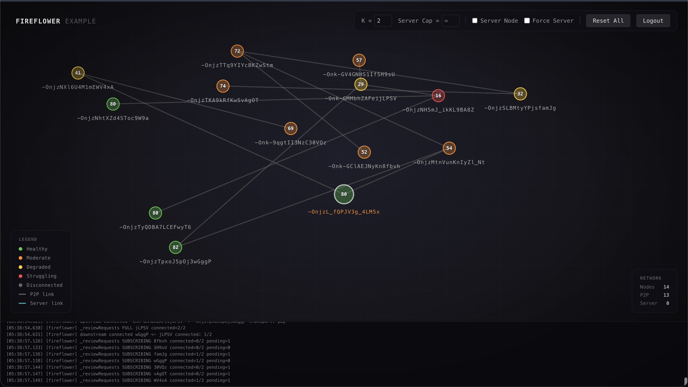
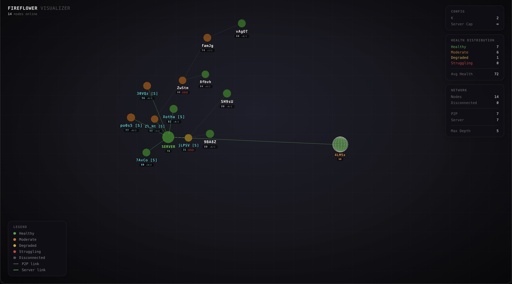

# Fireflower Visualizer

A 3D visualization tool for [fireflower](https://github.com/common-tater/fireflower) networks using Three.js and CSS3D. It connects to the same Firebase Realtime Database as your fireflower nodes to render the live topology.



## Demo

[Watch Video (MOV)](docs/media/fireflower-viz-vid.mov)




## Setup

1. **Install Dependencies**
   ```bash
   npm install
   ```

2. **Configure Firebase**
   Copy the example config and add your project credentials (same as your main fireflower app):
   ```bash
   cp firebase-config.example.js firebase-config.js
   ```
   Edit `firebase-config.js` with your Firebase keys.

## Run

Start the visualizer server:
```bash
npm start
```
Runs on **port 8081** by default to avoid conflict with the fireflower example (port 8080).

## Usage

Open [http://localhost:8081/tree](http://localhost:8081/tree) to view the visualization.

- **Nodes**: Spheres representing active peers.
- **Lines**: WebRTC connections between peers.
- **Labels**: Node IDs (last 5 chars).
